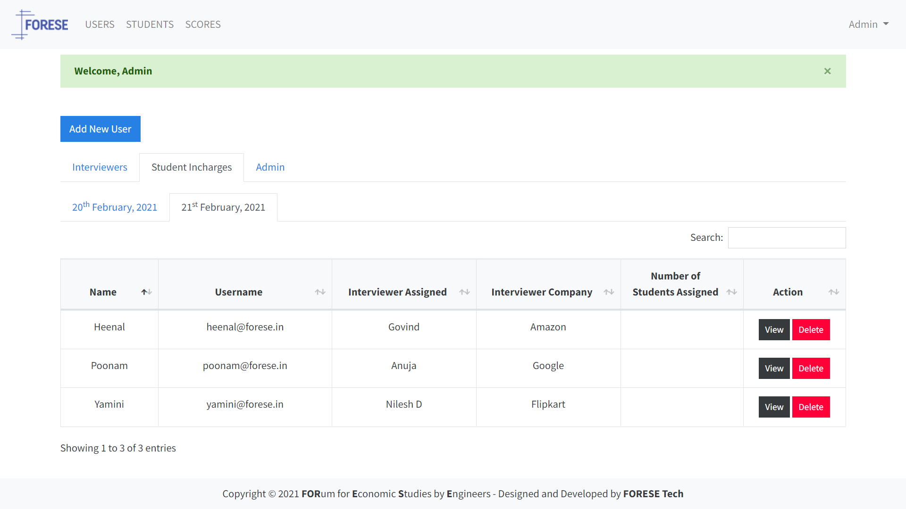

# HRSoftware


An application to record mock interview scores and allocate students for MOCKS 2021.

## Project Setup
```
Clone the repository to your local system
git clone https://github.com/ForeseTech/HRSoftware

Navigate to the cloned repo
cd HRSoftware/

Create a copy of the .env.example file and rename it to .env
cp .env.example .env

Replace the placeholder credentials in the .env file with your credentials

Install project dependencies
npm install

Start server in development mode
npm run dev

Start server in production
npm start
```

## Database Seeder

```
Import All Data
node seeder -i

Destroy All Data
node seeder -d
```

## Screenshots
| HR/Admin - Login                                   | Student Incharge  - Login                          | HR - Dashboard                                       |
| -------------------------------------------------- | -------------------------------------------------- | ---------------------------------------------------- |
|            |           |               |

| HR - Score a Student                               | Incharge - Dashboard                               | Incharge - Allocate Student                          |
| -------------------------------------------------- | -------------------------------------------------- | ---------------------------------------------------- |
|           |       |  |

| Admin - View HR                                    | Admin - View Single HR                             | Admin - Create User                                  |
| -------------------------------------------------- | -------------------------------------------------- | ---------------------------------------------------- |
|             |       |             |

| Admin - Allocate Students to HR                    | Admin - View Incharges                             | Admin - View Admins                                  |
| -------------------------------------------------- | -------------------------------------------------- | ---------------------------------------------------- |
|   |      |            |      

| Admin - View Students                              | Admin - View Single Student                        | Admin - Create Student                               | 
| -------------------------------------------------- | -------------------------------------------------- | ---------------------------------------------------- | 
|       |  |        | 

| Admin - Allocate HR's to Student                   | Admin - View Scores                                |
| -------------------------------------------------- | -------------------------------------------------- | 
|        |         |